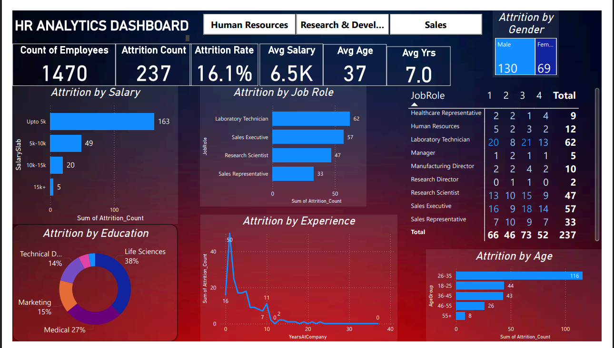
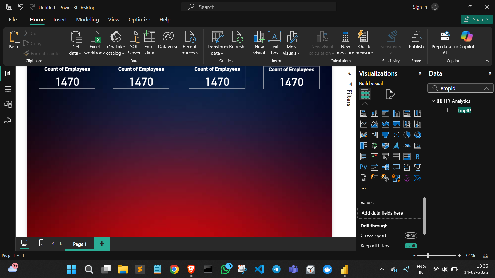
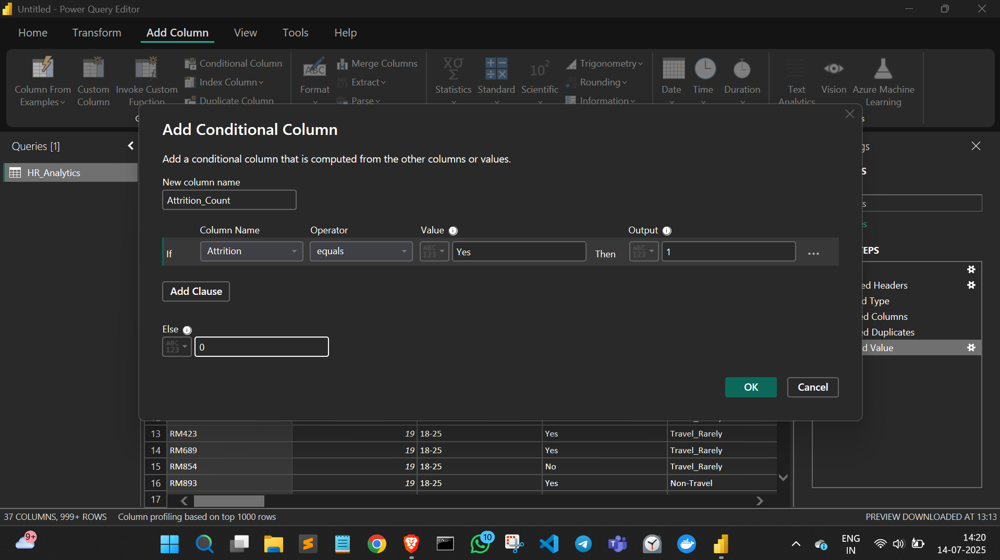
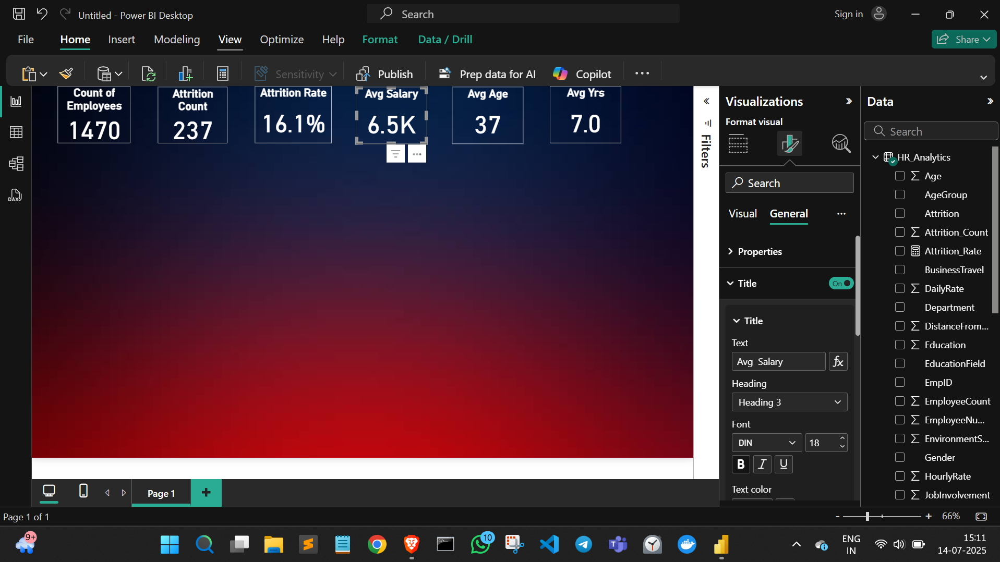
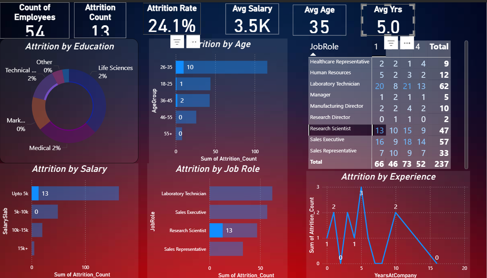

# HR Analytics Dashboard in Power BI

An interactive and insightful HR analytics dashboard built using Power BI, aimed at helping organizations monitor key HR metrics, improve employee performance, and boost retention rates.

## 📊 Project Overview

This project presents a professional HR dashboard that visualizes critical human resources data in a meaningful and interactive way. The dashboard provides department-level filtering and highlights key performance indicators (KPIs) such as:

- 📈 Attrition Rate  
- 👥 Average Age  
- 💰 Average Salary  
- 🏢 Years at Company  

## 🧰 Tech Stack

- **Power BI** – For data visualization and dashboard design  
- **DAX** – For calculated measures and KPIs  
- **Power Query (M)** – For data transformation and preprocessing  

## Flow of the Project
 1. Making of KPI

 2. Created all the KPI's

 3. KPI's done, now Charts

 4. Adding Charts

5. Final view of dashboard

## 🛠 Features

- ✅ **Interactive Filters**: Department-level filters to drill down and analyze specific teams or functions.  
- ✅ **KPI Cards**: Key metrics for quick insights into workforce trends.  
- ✅ **Visualizations**: Bar charts, line graphs, and tables to spot trends and anomalies in employee behavior.  
- ✅ **Clean Design**: A simple yet professional layout that’s easy to interpret and navigate.

## 🔍 Insights Uncovered
The dashboard enables HR teams and leadership to:

Identify roles and salary brackets with high attrition: Most attrition is among employees earning less than ₹5K and those in roles like Laboratory Technician, Sales Executive, and Research Scientist.

Understand attrition trends by experience and age: Highest attrition occurs within the first year and primarily among employees aged 26–35.

Analyze gender-wise attrition: Male employees account for nearly twice the attrition compared to female employees.

Track attrition by educational background: Employees with Life Sciences and Medical backgrounds show higher attrition levels.

Support data-driven decisions: Helps in targeting retention strategies based on job roles, salary, tenure, and demographics.

## 📬 Contact

For any questions or collaborations, feel free to reach out:

**Abhinay Bir**  
📧 abhinay.bir16@gmail.com  
🌐 [Linkedin Profile](https://www.linkedin.com/in/abhinay-bir-764a342b1/)  

